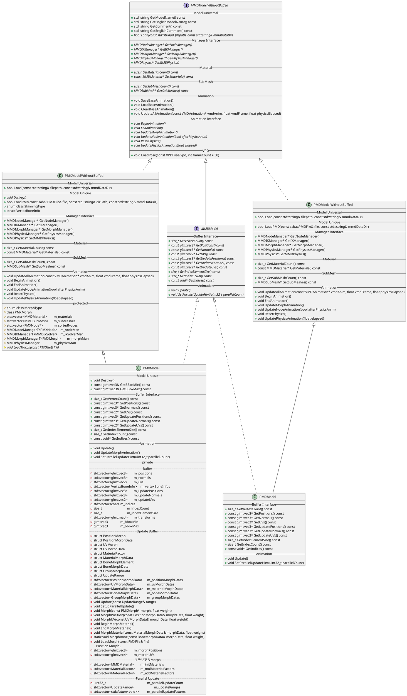

# Class

```plantuml
@startuml
interface MMDModelWithoutBuffed
{
-- Model Universal --
+std::string GetModelName() const
+std::string GetEnglishModelName() const
+std::string GetComment() const
+std::string GetEnglishComment() const
+{abstract} bool Load(const std::string& filepath, const std::string& mmdDataDir)
-- Manager Interface --
+{abstract} MMDNodeManager* GetNodeManager()
+{abstract} MMDIKManager* GetIKManager()
+{abstract} MMDMorphManager* GetMorphManager()
+{abstract} MMDPhysicsManager* GetPhysicsManager()
+{abstract} MMDPhysics* GetMMDPhysics()
-- Material --
+{abstract} size_t GetMaterialCount() const
+{abstract} const MMDMaterial* GetMaterials() const
-- SubMesh --
+{abstract} size_t GetSubMeshCount() const
+{abstract} MMDSubMesh* GetSubMeshes() const
-- Animation --
+void SaveBaseAnimation()
+void LoadBaseAnimation()
+void ClearBaseAnimation()
+void UpdateAllAnimation(const VMDAnimation* vmdAnim, float vmdFrame, float physicsElapsed)
.. Animation Interface ..
+{abstract} void BeginAnimation()
+{abstract} void EndAnimation()
+{abstract} void UpdateMorphAnimation()
+{abstract} void UpdateNodeAnimation(bool afterPhysicsAnim)
+{abstract} void ResetPhysics()
+{abstract} void UpdatePhysicsAnimation(float elapsed)
-- VPD --
+void LoadPose(const VPDFile& vpd, int frameCount = 30)
}
interface MMDModel
{
-- Buffer Interface --
+{abstract} size_t GetVertexCount() const
+{abstract} const glm::vec3* GetPositions() const
+{abstract} const glm::vec3* GetNormals() const
+{abstract} const glm::vec2* GetUVs() const
+{abstract} const glm::vec3* GetUpdatePositions() const
+{abstract} const glm::vec3* GetUpdateNormals() const
+{abstract} const glm::vec2* GetUpdateUVs() const
+{abstract} size_t GetIndexElementSize() const
+{abstract} size_t GetIndexCount() const
+{abstract} const void* GetIndices() const
-- Animation --
+{abstract} void Update()
+{abstract} void SetParallelUpdateHint(uint32_t parallelCount)
}
class PMXModelWithoutBuffed
{
-- Model Universal --
+ bool Load(const std::string& filepath, const std::string& mmdDataDir)
-- Model Unique --
+{abstract}void Destroy()
+ bool LoadPMX(const saba::PMXFile& file, const std::string& dirPath, const std::string& mmdDataDir)
+enum class SkinningType
+struct VertexBoneInfo
-- Manager Interface --
+MMDNodeManager* GetNodeManager()
+MMDIKManager* GetIKManager()
+MMDMorphManager* GetMorphManager()
+MMDPhysicsManager* GetPhysicsManager()
+MMDPhysics* GetMMDPhysics()
-- Material --
+size_t GetMaterialCount() const
+const MMDMaterial* GetMaterials() const
-- SubMesh --
+size_t GetSubMeshCount() const
+MMDSubMesh* GetSubMeshes() const
-- Animation --
+void UpdateAllAnimation(const VMDAnimation* vmdAnim, float vmdFrame, float physicsElapsed)
+void BeginAnimation()
+void EndAnimation()
+void UpdateNodeAnimation(bool afterPhysicsAnim)
+void ResetPhysics()
+void UpdatePhysicsAnimation(float elapsed)
-- protected --
#enum class MorphType
#class PMXMorph
#std::vector<MMDMaterial>	m_materials
#std::vector<MMDSubMesh>	m_subMeshes
#std::vector<PMXNode*>		m_sortedNodes
#MMDNodeManagerT<PMXNode>	m_nodeMan
#MMDIKManagerT<MMDIkSolver>	m_ikSolverMan
#MMDMorphManagerT<PMXMorph>	m_morphMan
#MMDPhysicsManager			m_physicsMan
#{abstract} void LoadMorph(const PMXFile& file)
}
class PMDModelWithoutBuffed
{
-- Model Universal --
+ bool Load(const std::string& filepath, const std::string& mmdDataDir)
-- Model Unique --
+ bool LoadPMD(const saba::PMDFile& file, const std::string& mmdDataDir)
-- Manager Interface --
+MMDNodeManager* GetNodeManager()
+MMDIKManager* GetIKManager()
+MMDMorphManager* GetMorphManager()
+MMDPhysicsManager* GetPhysicsManager()
+MMDPhysics* GetMMDPhysics()
-- Material --
+size_t GetMaterialCount() const
+const MMDMaterial* GetMaterials() const
-- SubMesh --
+size_t GetSubMeshCount() const
+MMDSubMesh* GetSubMeshes() const
-- Animation --
+void UpdateAllAnimation(const VMDAnimation* vmdAnim, float vmdFrame, float physicsElapsed)
+void BeginAnimation()
+void EndAnimation()
+void UpdateMorphAnimation()
+void UpdateNodeAnimation(bool afterPhysicsAnim)
+void ResetPhysics()
+void UpdatePhysicsAnimation(float elapsed)
}
class PMXModel
{
-- Model Unique --
+void Destroy()
+const glm::vec3& GetBBoxMin() const
+const glm::vec3& GetBBoxMax() const
-- Buffer Interface --
+size_t GetVertexCount() const
+const glm::vec3* GetPositions() const
+const glm::vec3* GetNormals() const
+const glm::vec2* GetUVs() const
+const glm::vec3* GetUpdatePositions() const
+const glm::vec3* GetUpdateNormals() const
+const glm::vec2* GetUpdateUVs() const
+size_t GetIndexElementSize() const
+size_t GetIndexCount() const
+const void* GetIndices() const
-- Animation --
+void Update()
+void UpdateMorphAnimation()
+void SetParallelUpdateHint(uint32_t parallelCount)
-- private --
.. Buffer ..
-std::vector<glm::vec3>	m_positions
-std::vector<glm::vec3>	m_normals
-std::vector<glm::vec2>	m_uvs
-std::vector<VertexBoneInfo>	m_vertexBoneInfos
-std::vector<glm::vec3>	m_updatePositions
-std::vector<glm::vec3>	m_updateNormals
-std::vector<glm::vec2>	m_updateUVs
-std::vector<char>	m_indices
-size_t				m_indexCount
-size_t				m_indexElementSize
-std::vector<glm::mat4>	m_transforms
-glm::vec3		m_bboxMin
-glm::vec3		m_bboxMax
.. Update Buffer ..
-struct PositionMorph
-struct PositionMorphData
-struct UVMorph
-struct UVMorphData
-struct MaterialFactor
-struct MaterialMorphData
-struct BoneMorphElement
-struct BoneMorphData
-struct GroupMorphData
-struct UpdateRange
-std::vector<PositionMorphData>	m_positionMorphDatas
-std::vector<UVMorphData>		m_uvMorphDatas
-std::vector<MaterialMorphData>	m_materialMorphDatas
-std::vector<BoneMorphData>		m_boneMorphDatas
-std::vector<GroupMorphData>		m_groupMorphDatas
-void Update(const UpdateRange& range)
-void SetupParallelUpdate()
-void Morph(const PMXMorph* morph, float weight)
-void MorphPosition(const PositionMorphData& morphData, float weight)
-void MorphUV(const UVMorphData& morphData, float weight)
-void BeginMorphMaterial()
-void EndMorphMaterial()
-void MorphMaterial(const MaterialMorphData& morphData, float weight)
-static void MorphBone(const BoneMorphData& morphData, float weight)
-void LoadMorph(const PMXFile& file)
.. Position Morph .
-std::vector<glm::vec3>	m_morphPositions
-std::vector<glm::vec4>	m_morphUVs
.. マテリアルMorph ..
-std::vector<MMDMaterial>	m_initMaterials
-std::vector<MaterialFactor>	m_mulMaterialFactors
-std::vector<MaterialFactor>	m_addMaterialFactors
.. Parallel Update ..
-uint32_t							m_parallelUpdateCount
-std::vector<UpdateRange>			m_updateRanges
-std::vector<std::future<void>>		m_parallelUpdateFutures
}
class PMDModel
{
-- Buffer Interface --
+size_t GetVertexCount() const
+const glm::vec3* GetPositions() const
+const glm::vec3* GetNormals() const
+const glm::vec2* GetUVs() const
+const glm::vec3* GetUpdatePositions() const
+const glm::vec3* GetUpdateNormals() const
+const glm::vec2* GetUpdateUVs() const
+size_t GetIndexElementSize() const
+size_t GetIndexCount() const
+const void* GetIndices() const
-- Animation --
+ void Update()
+void SetParallelUpdateHint(uint32_t parallelCount)
}

MMDModelWithoutBuffed<|--MMDModel
MMDModelWithoutBuffed<|..PMXModelWithoutBuffed
PMXModelWithoutBuffed<|--PMXModel
MMDModel<|..PMXModel
PMDModelWithoutBuffed<|--PMDModel
MMDModel<|..PMDModel
MMDModelWithoutBuffed<|..PMDModelWithoutBuffed
@enduml
```