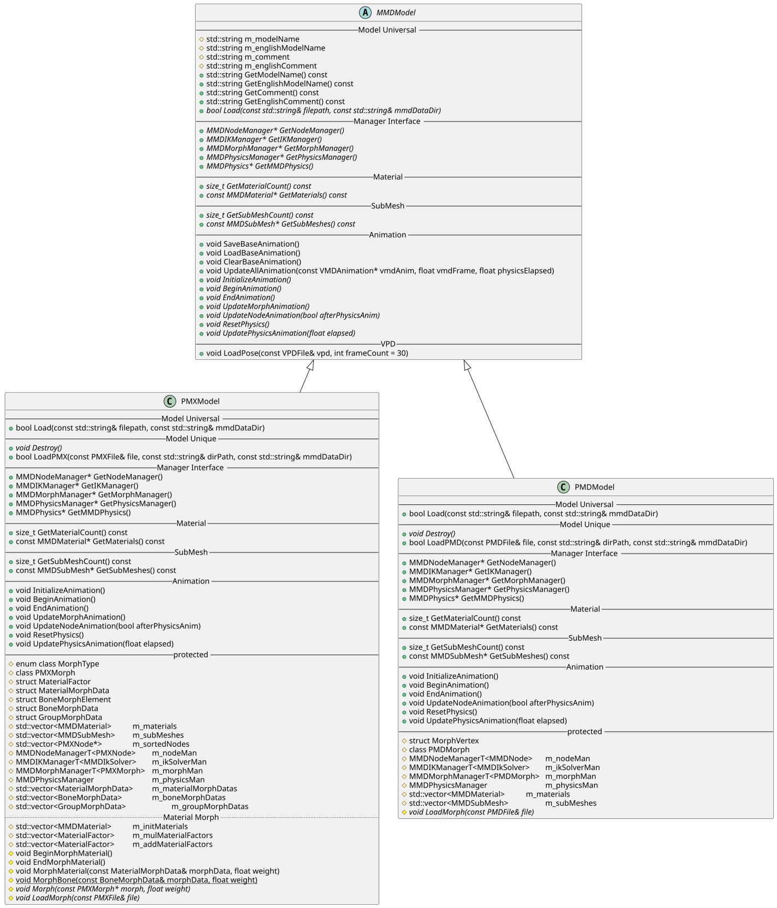
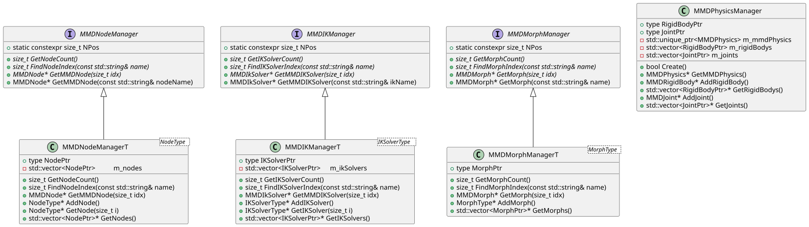
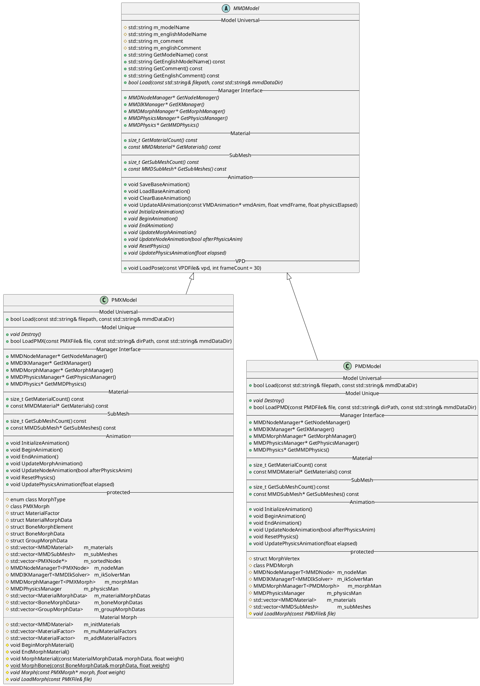
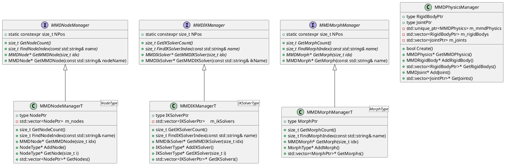

# Class

```plantuml
@startuml
abstract class MMDModel
{
-- Model Universal --
#std::string m_modelName
#std::string m_englishModelName
#std::string m_comment
#std::string m_englishComment
+std::string GetModelName() const
+std::string GetEnglishModelName() const
+std::string GetComment() const
+std::string GetEnglishComment() const
+{abstract} bool Load(const std::string& filepath, const std::string& mmdDataDir)
-- Manager Interface --
+{abstract} MMDNodeManager* GetNodeManager()
+{abstract} MMDIKManager* GetIKManager()
+{abstract} MMDMorphManager* GetMorphManager()
+{abstract} MMDPhysicsManager* GetPhysicsManager()
+{abstract} MMDPhysics* GetMMDPhysics()
-- Material --
+{abstract} size_t GetMaterialCount() const
+{abstract} const MMDMaterial* GetMaterials() const
-- SubMesh --
+{abstract} size_t GetSubMeshCount() const
+{abstract} const MMDSubMesh* GetSubMeshes() const
-- Animation --
+void SaveBaseAnimation()
+void LoadBaseAnimation()
+void ClearBaseAnimation()
+void UpdateAllAnimation(const VMDAnimation* vmdAnim, float vmdFrame, float physicsElapsed)
+{abstract} void InitializeAnimation()
+{abstract} void BeginAnimation()
+{abstract} void EndAnimation()
+{abstract} void UpdateMorphAnimation()
+{abstract} void UpdateNodeAnimation(bool afterPhysicsAnim)
+{abstract} void ResetPhysics()
+{abstract} void UpdatePhysicsAnimation(float elapsed)
-- VPD --
+void LoadPose(const VPDFile& vpd, int frameCount = 30)
}
class PMXModel
{
-- Model Universal --
+ bool Load(const std::string& filepath, const std::string& mmdDataDir)
-- Model Unique --
+{abstract} void Destroy()
+ bool LoadPMX(const PMXFile& file, const std::string& dirPath, const std::string& mmdDataDir)
-- Manager Interface --
+MMDNodeManager* GetNodeManager()
+MMDIKManager* GetIKManager()
+MMDMorphManager* GetMorphManager()
+MMDPhysicsManager* GetPhysicsManager()
+MMDPhysics* GetMMDPhysics()
-- Material --
+size_t GetMaterialCount() const
+const MMDMaterial* GetMaterials() const
-- SubMesh --
+size_t GetSubMeshCount() const
+const MMDSubMesh* GetSubMeshes() const
-- Animation --
+void InitializeAnimation()
+void BeginAnimation()
+void EndAnimation()
+void UpdateMorphAnimation()
+void UpdateNodeAnimation(bool afterPhysicsAnim)
+void ResetPhysics()
+void UpdatePhysicsAnimation(float elapsed)
-- protected --
#enum class MorphType
#class PMXMorph
#struct MaterialFactor
#struct MaterialMorphData
#struct BoneMorphElement
#struct BoneMorphData
#struct GroupMorphData
#std::vector<MMDMaterial>	m_materials
#std::vector<MMDSubMesh>	m_subMeshes
#std::vector<PMXNode*>		m_sortedNodes
#MMDNodeManagerT<PMXNode>	m_nodeMan
#MMDIKManagerT<MMDIkSolver>	m_ikSolverMan
#MMDMorphManagerT<PMXMorph>	m_morphMan
#MMDPhysicsManager			m_physicsMan
#std::vector<MaterialMorphData>	m_materialMorphDatas
#std::vector<BoneMorphData>		m_boneMorphDatas
#std::vector<GroupMorphData>		m_groupMorphDatas
.. Material Morph ..
#std::vector<MMDMaterial>	m_initMaterials
#std::vector<MaterialFactor>	m_mulMaterialFactors
#std::vector<MaterialFactor>	m_addMaterialFactors
#void BeginMorphMaterial()
#void EndMorphMaterial()
#void MorphMaterial(const MaterialMorphData& morphData, float weight)
#{static} void MorphBone(const BoneMorphData& morphData, float weight)
#{abstract} void Morph(const PMXMorph* morph, float weight)
#{abstract} void LoadMorph(const PMXFile& file)
}
class PMDModel
{
-- Model Universal --
+ bool Load(const std::string& filepath, const std::string& mmdDataDir)
-- Model Unique --
+ {abstract} void Destroy()
+ bool LoadPMD(const PMDFile& file, const std::string& dirPath, const std::string& mmdDataDir)
-- Manager Interface --
+MMDNodeManager* GetNodeManager()
+MMDIKManager* GetIKManager()
+MMDMorphManager* GetMorphManager()
+MMDPhysicsManager* GetPhysicsManager()
+MMDPhysics* GetMMDPhysics()
-- Material --
+size_t GetMaterialCount() const
+const MMDMaterial* GetMaterials() const
-- SubMesh --
+size_t GetSubMeshCount() const
+const MMDSubMesh* GetSubMeshes() const
-- Animation --
+void InitializeAnimation()
+void BeginAnimation()
+void EndAnimation()
+void UpdateNodeAnimation(bool afterPhysicsAnim)
+void ResetPhysics()
+void UpdatePhysicsAnimation(float elapsed)
-- protected --
#struct MorphVertex
#class PMDMorph
#MMDNodeManagerT<MMDNode>	m_nodeMan
#MMDIKManagerT<MMDIkSolver>	m_ikSolverMan
#MMDMorphManagerT<PMDMorph>	m_morphMan
#MMDPhysicsManager			m_physicsMan
#std::vector<MMDMaterial>	m_materials
#std::vector<MMDSubMesh>		m_subMeshes
#{abstract} void LoadMorph(const PMDFile& file)
}

MMDModel <|-- PMXModel
MMDModel <|-- PMDModel
@enduml
```

```plantuml
@startuml
interface MMDNodeManager
{
+static constexpr size_t NPos
+{abstract}size_t GetNodeCount()
+{abstract}size_t FindNodeIndex(const std::string& name)
+{abstract}MMDNode* GetMMDNode(size_t idx)
+MMDNode* GetMMDNode(const std::string& nodeName)
}
interface MMDIKManager
{
+static constexpr size_t NPos
+{abstract}size_t GetIKSolverCount()
+{abstract}size_t FindIKSolverIndex(const std::string& name)
+{abstract}MMDIkSolver* GetMMDIKSolver(size_t idx)
+MMDIkSolver* GetMMDIKSolver(const std::string& ikName)
}
interface MMDMorphManager
{
+static constexpr size_t NPos
+{abstract}size_t GetMorphCount()
+{abstract}size_t FindMorphIndex(const std::string& name)
+{abstract}MMDMorph* GetMorph(size_t idx)
+MMDMorph* GetMorph(const std::string& name)
}
class MMDPhysicsManager
{
+type RigidBodyPtr
+type JointPtr
+bool Create()
+MMDPhysics* GetMMDPhysics()
+MMDRigidBody* AddRigidBody()
+std::vector<RigidBodyPtr>* GetRigidBodys()
+MMDJoint* AddJoint()
+std::vector<JointPtr>* GetJoints()
-std::unique_ptr<MMDPhysics> m_mmdPhysics
-std::vector<RigidBodyPtr> m_rigidBodys
-std::vector<JointPtr> m_joints
}
class MMDNodeManagerT<NodeType>
{
+type NodePtr
+size_t GetNodeCount()
+size_t FindNodeIndex(const std::string& name)
+MMDNode* GetMMDNode(size_t idx)
+NodeType* AddNode()
+NodeType* GetNode(size_t i)
+std::vector<NodePtr>* GetNodes()
-std::vector<NodePtr>	m_nodes
}
class MMDIKManagerT<IKSolverType>
{
+type IKSolverPtr
+size_t GetIKSolverCount()
+size_t FindIKSolverIndex(const std::string& name)
+MMDIkSolver* GetMMDIKSolver(size_t idx)
+IKSolverType* AddIKSolver()
+IKSolverType* GetIKSolver(size_t i)
+std::vector<IKSolverPtr>* GetIKSolvers()
-std::vector<IKSolverPtr>	m_ikSolvers
}
class MMDMorphManagerT<MorphType>
{
+type MorphPtr
+size_t GetMorphCount()
+size_t FindMorphIndex(const std::string& name)
+MMDMorph* GetMorph(size_t idx)
+MorphType* AddMorph()
+std::vector<MorphPtr>* GetMorphs()
}
MMDNodeManager <|-- MMDNodeManagerT
MMDIKManager <|-- MMDIKManagerT
MMDMorphManager <|-- MMDMorphManagerT
@enduml
```
